<p align="center"></p>

<p align="center">
    <a style="text-decoration:none !important;" href="http://arxiv.org/abs/2102.06202" alt="arXiv">  </a>
    <a style="text-decoration:none !important;" href="https://docs.conda.io/en/latest/miniconda.html" alt="package management">  </a>
    <a style="text-decoration:none !important;" href="https://opensource.org/licenses/MIT" alt="License">  </a>

</p>

## Paper 
[Private Prediction Sets](https://arxiv.org/abs/2102.06202)
```
@article{angelopoulos-private-sets,
  title={Private Prediction Sets},
  author={Angelopoulos, Anastasios N and Bates, Stephen and Zrnic, Tijana and Jordan, Michael I},
  journal={arXiv preprint arXiv:2102.06202},
  year={2021}
}

```

## Basic Overview
<p>
  This GitHub contains the code we used for the experiments in the private prediction sets paper.
  Each experiment lives in a different, appropriately named folder.
  The directory <code>core</code> contains code common to all of our experiments, including the implementations of the private quantile subroutine.
  <b> The repository is still a work in progress</b>; we will be continually updating the code to make it more user-friendly and remove clutter from our development.
</p>

## Getting Started 
<p>
  You will need <code>conda</code>. 
  Execute the following line in the root directory of our repository:
</p>

```
bash setup.sh
```
<p>
  This file will set up the conda environment <code>pps</code> and fetch the required data. 
</p>

<p>
  Each experiment requires different datasets. 
  The <code>CIFAR-10</code> dataset and <a href="https://www.kaggle.com/praveengovi/coronahack-chest-xraydataset"><code>Coronahack</code></a> dataset will automatically download when the experiments run or during setup. 
  For the <code>./imagenet</code> experiments, you will need to point the scripts towards the val directory of your local copy of the Imagenet dataset.
</p>

## Reproducing the model training 
<p>
  To train the <code>CIFAR-10</code> models used in our experiments from scratch, you will need to modify the <code>opacus</code> library directly. In particular, locate the directory containing the opacus library. For me, it is
</p>

```
~/anaconda3/envs/pps/lib/python3.8/site-packages/opacus
``` 

<p>
  Within this directory, modify line 395 of <code>privacy_engine.py</code> from <code>self.noise_multiplier * max_grad_norm,</code> to <code>2 * self.noise_multiplier * max_grad_norm,</code>  
</p>

<p>
  This adjusts the training procedure to use the replacement definition of privacy, consistent with our paper.
</p>

## License
<a href="https://opensource.org/licenses/MIT" alt="License">MIT License</a>
